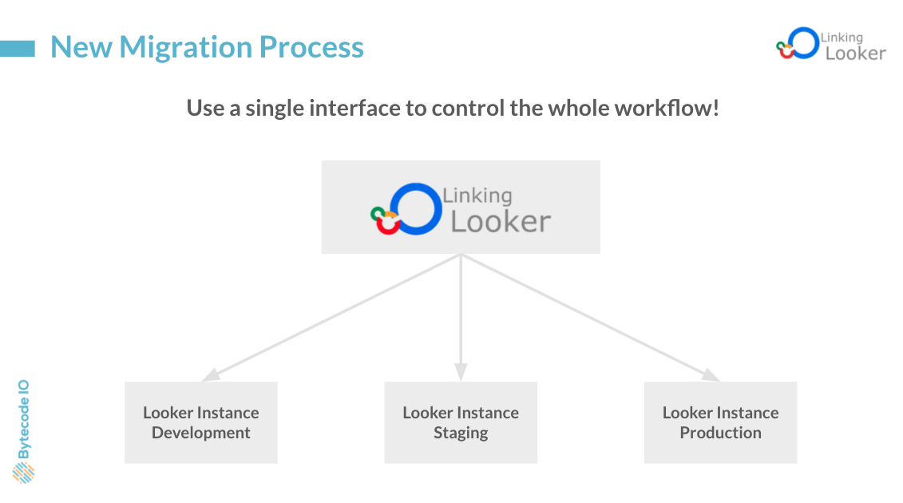

# Linking Looker
## Bytecode.io and the Looker Extension Framework
##

**Mission**: To deliver a *zero downtime deployment* with a new **Looker Extension Framework** utility.
- Assists in managing multiple Looker instances by comparing and updating code and content across instances.
- With an increase in the number of Enterprise clients using Looker, having a way to easily deploy to production with confidence that:
   - Content in production will not break
   - Uptime remains as close to 100% as possible has become increasingly important
 - Linking Looker provides an interface within a source Looker instance (e.g., dev or staging) that checks aspects (such as content or permissoins) in a target Looker instance (e.g., prod) for differences and errors prior to deployment of LookML.